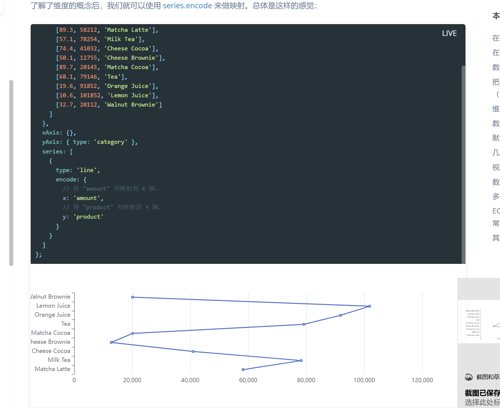

# DataCenterdTech以数据为中心的技术体系文件夹
## 11月18日

### Parent组件:
- 通用布局主页模板,仅Header\Content\Footer部分的那个
- 三个导航的路由跳转
- Content的部分的输出槽
- echarts,仅仅在组件中使用

### 路由配置
- 

### Page1组件
- Grid栅格式2 2分布  
  - 下拉框选择内容
    - 选择领域
      - 默认为data management
    - 选择时间
      - 默认为2022
- 4*3的表格
  - 标题
  - 数据
  - 可点击事件跳转至Page2

固定样式4*3

### Page2组件:
- 10列表格,填充写死的数据,进行基础设计
- 
- antd下拉式选项*2,实现写死数据的替换
- 

### Page3组件
大致想法是,使用折线图,在Y轴在左边,是技术名称,X轴在下方,是年代,一条线表示一个技术随着时间的名称变化,没有变化或断掉时为一条直线,有变化时则折线到新技术名称上
相当是说,每条线才是一个技术的实体,左侧的名称仅仅是一个值

👇一个奇怪但是相近意思的例子

只能考虑是将请求格式的数据改成echarts格式后再进行导入了

更改为桑基图sankey
- 引入
- 尝试确认必要的参数
- 修改至想要的效果

**关于桑基图**
如何处理toolbar的显示的参数
处理分布

确认data中的分层属性

处理toolbar

// 桑基图的一个特点是所谓能量守恒,从入到出的有一个能量的变化
// 建立data中depth与时间的关系,可以设置变化的节点和层次点

### 待解决的问题
Parent里面的导航栏的原理,那个selectkey是干嘛的

找到好的表格,进行进一步定制
- json数据提供,处理行列内容

- [ ]Page2处理数据时,定义需要给出缩略,序号页面请求后给出,领域和时间是给定的,需要赋予

### 与后端传输数据记录
page1

page2

page3

### 用户的一些流程
直接进入页面1:此时需要加载展示默认数据(或**向后端发送领域和时间数据,**,**获取从后端请求得到的数据**后展示数据:**该时间和领域下的所有层次和层次拥有技术的数量**) 
下拉选择领域 OR 下拉选择层次 后更新选择: 此时页面需要**向后端发送领域和时间数据**,**获取从后端请求得到的数据**后展示数据:**该时间和领域下的所有层次和层次拥有技术的数量**

直接进入页面2(目前没写好,要么设置disable,要么设置**从当前页面获取领域和时间数据,向后端发起请求**,**从后端请求得到数据**后展示数据:**技术基础信息**)
点击12个宫格进入页面2:此时需要**获取点击的数据,向后端发送请求领域\层次\时间**,**获取从后端请求得到的数据**后展示数据:**技术基础信息**
下拉选择领域领域 OR 下拉选择层次 OR 下拉选择时间 后更新查询条件:此时需要**获取查询条件数据,向后端发送领域\层次\时间**,**从后端请求得到数据**后展示数据:**技术基础信息**

选择一个或多个技术进行时序seriesLayoutBy: 'row'发展查看:此时需要**获取被选择的技术的信息,向后端发送技术数据**,**从后端请求数据**展示数据:**被选择技术随时间发展的不同名称**

风格参考智慧助老那个网页
学后端的东西,了解后端的内容
gitlab
Page2:单项下拉栏展示技术详细信息
Page2-->Page3数据沟通
Page3:采用树状图的形式(树状图)[https://echarts.apache.org/examples/zh/editor.html?c=tree-orient-right-left]加时间轴线,对准

